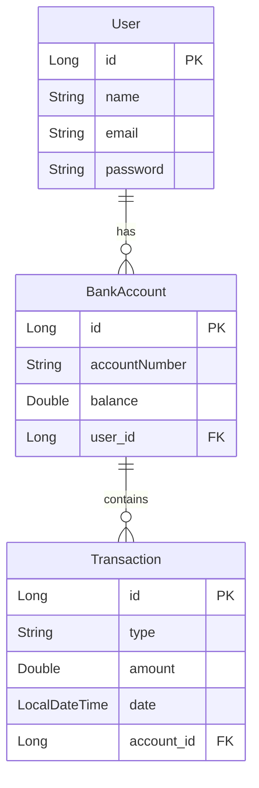

# BankSofka - Sistema Bancario

## Documentación Técnica

### Arquitectura del Sistema
El sistema está construido usando Spring Boot y sigue una arquitectura en capas:
- Controllers (API REST)
- Services (Lógica de negocio)
- Repositories (Acceso a datos)
- Models (Entidades)

### Diagrama Entidad-Relación



### Tecnologías Utilizadas
- Spring Boot
- Spring Security + JWT
- JPA
- H2 Database
- Lombok
- Gradle

### Endpoints API
#### Autenticación
- POST `/api/auth/login` - Iniciar sesión
  ```json
  {
    "email": "usuario@ejemplo.com",
    "password": "contraseña"
  }
  ```

#### Usuarios
- POST `/api/users` - Crear usuario
- PUT `/api/users/{userId}` - Actualizar usuario
- DELETE `/api/users/{userId}` - Eliminar usuario
- GET `/api/users/{userId}/accounts` - Obtener cuentas del usuario

#### Cuentas y Transacciones
- POST `/api/accounts/{userId}` - Crear cuenta
- GET `/api/accounts/{accountId}/balance` - Consultar saldo
- POST `/api/accounts/{accountId}/deposit` - Realizar depósito
- POST `/api/accounts/{accountId}/withdrawal` - Realizar retiro
- GET `/api/accounts/{accountId}/transactions` - Obtener historial

### Seguridad
- Autenticación basada en JWT
- Contraseñas encriptadas con BCrypt
- Filtrado de peticiones por token

## Manual de Usuario

### Primeros Pasos

1. Registro de Usuario
    - Enviar POST a `/api/users` con datos del usuario
    - Guardar el ID de usuario recibido

2. Inicio de Sesión
    - Enviar credenciales a `/api/auth/login`
    - Guardar el token JWT recibido
    - Usar el token en header: `Authorization: Bearer <token>`

### Operaciones Bancarias

#### Crear Cuenta
1. Usar el ID de usuario para crear una cuenta bancaria
2. La cuenta se crea con saldo 0
3. Se genera automáticamente un número de cuenta único

#### Depósitos y Retiros
1. Usar el ID de la cuenta para operaciones
2. Para depósitos:
    - Especificar monto positivo
    - No hay límite de depósito
3. Para retiros:
    - Debe haber saldo suficiente
    - Monto debe ser positivo

#### Consultas
1. Saldo:
    - Muestra saldo actual y número de cuenta
2. Transacciones:
    - Muestra historial ordenado por fecha
    - Incluye tipo, monto y fecha de cada operación

### Recomendaciones de Seguridad
- Mantener seguro el token JWT
- Cerrar sesión al terminar (TODO: Pendiente de implementación)
- No compartir credenciales
- Verificar saldos después de operaciones