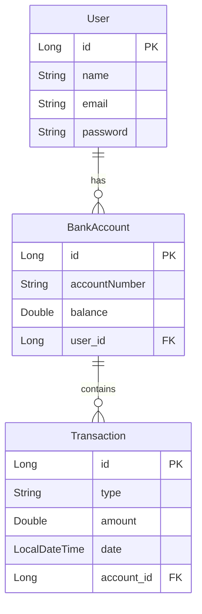

# BankSofka - Sistema Bancario

## Documentación Técnica

### Arquitectura del Sistema
El sistema está construido usando Spring Boot y sigue una arquitectura en capas:
- Controllers (API REST)
- Services (Lógica de negocio)
- Repositories (Acceso a datos)
- Models (Entidades)

### Diagrama Entidad-Relación



### Tecnologías Utilizadas
- Spring Boot
- Spring Security + JWT
- JPA
- H2 Database
- Lombok
- Gradle

### Endpoints API
#### Autenticación
- POST `/api/auth/login` - Iniciar sesión
  ```json
  {
    "email": "usuario@ejemplo.com",
    "password": "contraseña"
  }
  ```

#### Usuarios
- POST `/api/users` - Crear usuario
- PUT `/api/users/{userId}` - Actualizar usuario
- DELETE `/api/users/{userId}` - Eliminar usuario
- GET `/api/users/{userId}/accounts` - Obtener cuentas del usuario

#### Cuentas y Transacciones
- POST `/api/accounts/{userId}` - Crear cuenta
- GET `/api/accounts/{accountId}/balance` - Consultar saldo
- POST `/api/accounts/{accountId}/deposit` - Realizar depósito
- POST `/api/accounts/{accountId}/withdrawal` - Realizar retiro
- GET `/api/accounts/{accountId}/transactions` - Obtener historial

### Seguridad
- Autenticación basada en JWT
- Contraseñas encriptadas con BCrypt
- Filtrado de peticiones por token

## Manual de Usuario

### Primeros Pasos

1. Registro de Usuario
    - Enviar POST a `/api/users` con datos del usuario
    - Guardar el ID de usuario recibido

2. Inicio de Sesión
    - Enviar credenciales a `/api/auth/login`
    - Guardar el token JWT recibido
    - Usar el token en header: `Authorization: Bearer <token>`

### Operaciones Bancarias

#### Crear Cuenta
1. Usar el ID de usuario para crear una cuenta bancaria
2. La cuenta se crea con saldo 0
3. Se genera automáticamente un número de cuenta único

#### Depósitos y Retiros
1. Usar el ID de la cuenta para operaciones
2. Para depósitos:
    - Especificar monto positivo
    - No hay límite de depósito
3. Para retiros:
    - Debe haber saldo suficiente
    - Monto debe ser positivo

#### Consultas
1. Saldo:
    - Muestra saldo actual y número de cuenta
2. Transacciones:
    - Muestra historial ordenado por fecha
    - Incluye tipo, monto y fecha de cada operación

### Recomendaciones de Seguridad
- Mantener seguro el token JWT
- Cerrar sesión al terminar (TODO: Pendiente de implementación)
- No compartir credenciales
- Verificar saldos después de operaciones

## Construcción y Despliegue
Este proyecto sigue un flujo de Integración y Despliegue Continuo (CI/CD) utilizando las siguientes tecnologías:

- Docker: Para la creación de imágenes contenedoras de la aplicación.
- GitHub Actions: Para la automatización de pruebas, análisis de código y construcción de imágenes.
- GitHub Container Registry (GHCR): Para almacenar y versionar las imágenes Docker.
- SonarCloud: Para el análisis estático de código y la mejora de la calidad del software.
- Podman: Para el despliegue local de la aplicación sin necesidad de un daemon de Docker.

### Requisitos Previos
- Docker o Podman instalado en tu máquina local.
- Cuenta en GitHub con acceso a GitHub Actions y GitHub Container Registry.
- Cuenta en SonarCloud vinculada a tu repositorio de GitHub.

### Proceso de Construcción y Despliegue
1. Construir la Aplicación con Docker

Para construir la imagen Docker de la aplicación, ejecuta el siguiente comando en la raíz del proyecto:

    
         docker build -t banksofka:latest

Este comando compila el proyecto con Gradle y crea una imagen Docker con el nombre banksofka y la etiqueta latest.

2. Ejecutar la Aplicación Localmente con Docker

Una vez construida la imagen, puedes ejecutar la aplicación localmente con:

```
docker run -p 8080:8080 banksofka:latest
```

La aplicación estará disponible en http://localhost:8080.

3. Automatización con GitHub Actions

El flujo CI/CD está configurado en el archivo .github/workflows/cicd.yml. Este flujo realiza las siguientes acciones:

- Pruebas y Análisis de Código:

- Ejecuta las pruebas unitarias con Gradle.

- Analiza la calidad del código con SonarCloud.

- Construcción y Publicación de la Imagen Docker:

- Construye la imagen Docker utilizando el Dockerfile.

- Publica la imagen en GitHub Container Registry (GHCR) con dos etiquetas:

- latest: Para la última versión en la rama main.

- vX.Y.Z: Para versiones específicas (usando tags semánticos).

4. Desplegar Localmente con Podman

Si prefieres usar Podman en lugar de Docker, sigue estos pasos:

- Autenticación en GHCR:

```
echo $GHCR_TOKEN | podman login ghcr.io -u TU_USER_GITHUB --password-stdin
```
Nota: GHCR_TOKEN es un token de acceso personal de GitHub con permisos para leer paquetes.

- Descargar la Imagen:

```
podman pull ghcr.io/tulio-rangel/bankproject:latest
```
- Ejecutar la Aplicación:

```
podman run -p 8080:8080 ghcr.io/tulio-rangel/bankproject:latest
```
5. Versionado de Imágenes

Las imágenes se versionan automáticamente en GHCR utilizando:

- Tags Semánticos: Cuando se crea un tag en el repositorio (por ejemplo, v1.0.0), se genera una imagen con esa versión.

- Latest: Siempre apunta a la última versión estable en la rama main.